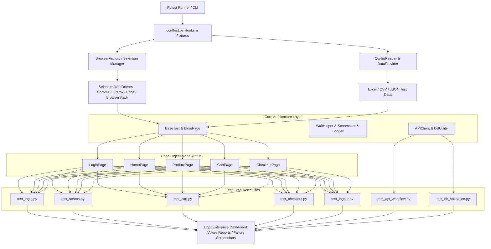

# 🚀 Enterprise Selenium Python Test Automation Framework

[](https://www.python.org/)
[](https://www.selenium.dev/)
[](https://docs.pytest.org/)
[](LICENSE)
[](.github/workflows/regression.yml)
[](browserstack.yml)

An **enterprise-grade, scalable, and modular test automation framework** built using **Python**, **Selenium WebDriver**, **pytest**, and the **Page Object Model (POM)** pattern.

This framework is designed for production Web UI testing, REST API automation, database data-integrity validation, cross-browser cloud execution (BrowserStack), Docker containerization, and continuous integration (Jenkins & GitHub Actions).

---

## 📸 Enterprise Dashboard Preview

The framework generates a commercial-grade, light-themed executive dashboard (`reports/dashboard.html`) after every test execution:

- **Executive Summary KPI Cards**: Total Tests, Passed, Failed, Skipped, Execution Time, and Success Rate with count-up animations.
- **Interactive Chart.js Visualizers**: Pass vs Fail Doughnut, Runtime Trend Line Chart, Module Distribution Bar Chart, Test Duration Breakdown, Browser Breakdown, and Quality Score Gauge.
- **Searchable, Sortable & Paginated Test Table**: Real-time filtering, column sorting, pagination controls, failure screenshot inspection modals, and log code viewer modals.
- **Multi-Format Reports Export**: PDF, Excel, and CSV table generation.

---

## 🏗️ Architecture & Component Design



---

## 📂 Repository Directory Layout

```
Enterprise_Selenium_Python_Automation_Framework/
├── .github/
│   └── workflows/
│       └── regression.yml          # GitHub Actions CI/CD pipeline
├── ci/                             # CI scripts and configs
├── docker/                         # Docker environment configurations
├── docs/                           # Framework architecture documentation
├── drivers/                        # Local driver cache directory
├── logs/                           # Automated framework execution logs
├── reports/                        # Execution HTML, Allure, & JUnit XML reports
│   └── dashboard.html              # Premium Enterprise Executive HTML Dashboard
├── screenshots/                    # Failure screenshot capture store
│   └── failures/
├── src/
│   ├── base/
│   │   └── base_test.py            # Base test initialization fixture class
│   ├── config/
│   │   ├── config.ini              # Multi-environment config (QA/UAT/PROD)
│   │   └── config_reader.py        # Configuration parser
│   ├── pages/                      # Page Object Model (POM) classes
│   │   ├── login_page.py           # SauceDemo Login POM
│   │   ├── home_page.py            # SauceDemo Products Inventory POM
│   │   ├── product_page.py         # Product Detail POM
│   │   ├── cart_page.py            # Cart POM
│   │   └── checkout_page.py        # Checkout POM
│   ├── reports/
│   │   ├── enterprise_dashboard.py # Standalone Light HTML Dashboard Builder
│   │   └── report_manager.py       # Metadata & Pytest-HTML injection manager
│   ├── services/                   # REST API Automation Layer
│   │   ├── api_client.py           # HTTP Client (GET/POST/PUT/DELETE)
│   │   └── user_api.py             # User API Service Object
│   └── utils/                      # Core Utility Helpers
│       ├── browser_factory.py      # Cross-browser & BrowserStack factory
│       ├── data_provider.py        # Multi-format data parser
│       ├── db_utility.py           # MySQL/PostgreSQL/SQLite DB connector & verification
│       ├── email_reporter.py       # Automated SMTP HTML report dispatcher
│       ├── excel_reader.py         # OpenPyXL Excel data reader
│       ├── logger.py               # Enterprise rotating logger
│       ├── screenshot.py           # Failure screenshot utility
│       ├── soft_assert.py          # Non-blocking multi-step soft assertions
│       ├── test_data_generator.py  # Synthetic test data generator
│       └── wait_helper.py          # Explicit wait synchronization wrappers
├── testdata/
│   ├── Login.xlsx                  # User authentication Excel dataset
│   └── Products.xlsx               # Inventory product Excel dataset
├── tests/
│   ├── api/
│   │   └── test_api_workflow.py   # REST API automation tests
│   ├── database/
│   │   └── test_db_validation.py  # UI vs Database integrity tests
│   ├── test_cart.py                # Shopping cart UI tests
│   ├── test_checkout.py            # E2E checkout workflow UI tests
│   ├── test_login.py               # Authentication UI tests
│   ├── test_logout.py              # User session logout UI tests
│   └── test_search.py              # Catalog discovery & detail UI tests
├── browserstack.yml                # BrowserStack cloud execution configuration
├── CHANGELOG.md                    # Release history and version updates
├── conftest.py                     # Global pytest fixtures, CLI options, & hooks
├── CONTRIBUTING.md                 # Open-source contributor guidelines
├── docker-compose.yml              # Multi-container orchestration definition
├── Dockerfile                      # Container image definition
├── Jenkinsfile                     # Declarative Jenkins CI/CD pipeline
├── LICENSE                         # MIT License
├── pytest.ini                      # Pytest execution settings, markers, & reports
└── requirements.txt                # Python dependencies
```

---

## ⚡ Quick Start & Installation

### 1. Prerequisites
- Python 3.10+ installed
- Git installed
- Google Chrome / Mozilla Firefox / Microsoft Edge browser

### 2. Setup Virtual Environment
```bash
# Clone the repository
git clone https://github.com/your-username/Enterprise_Selenium_Python_Automation_Framework.git
cd Enterprise_Selenium_Python_Automation_Framework

# Create virtual environment
python -m venv venv

# Activate virtual environment
# Windows (PowerShell):
.\venv\Scripts\Activate.ps1
# macOS/Linux:
source venv/bin/activate

# Install dependencies
pip install --upgrade pip
pip install -r requirements.txt
```

---

## 🚀 Execution Commands

### Local Web Execution
```bash
# Execute suite headlessly on Chrome (Default)
pytest --browser=chrome --headless

# Execute suite on Firefox or Edge
pytest --browser=firefox --headless
pytest --browser=edge --headless
```

### Parallel Execution (pytest-xdist)
```bash
# Run test suite across CPU cores in parallel
pytest -n auto --headless
```

### Pytest Marker Filtering
```bash
pytest -m smoke --headless       # Run Smoke suite
pytest -m regression --headless  # Run Regression suite
pytest -m api                    # Run REST API suite
pytest -m db                     # Run Database Validation suite
```

---

## ☁️ Cloud & Container Execution

### BrowserStack Cloud Grid
```bash
# Set BrowserStack Credentials
export BROWSERSTACK_USERNAME="your_username"
export BROWSERSTACK_ACCESS_KEY="your_access_key"

# Execute suite on BrowserStack
pytest --browser=browserstack
```

### Docker Containerization
```bash
# Build and run container suite via Docker Compose
docker-compose up --build
```

---

## 🛠️ CI/CD Pipeline Support

- **GitHub Actions**: Configured in `.github/workflows/regression.yml`. Automatically runs regression suite on every push and pull request to `main`.
- **Jenkins CI**: Configured in `Jenkinsfile`. Includes declarative stages for dependency installation, parallel execution, HTML report publishing (`reports/dashboard.html`), and failure screenshot archiving.

---

## ❓ Troubleshooting

| Issue | Cause | Solution |
|---|---|---|
| `WebDriverException` | Missing or outdated browser binary | The framework uses Selenium 4's built-in `SeleniumManager` with automatic fallback. Ensure browser is installed. |
| `FileNotFoundError` | Excel data file missing | Run `pytest` commands directly from the project root directory. |
| `MemoryError` in driver manager | Network rate limit on driver API | `BrowserFactory` automatically handles fallbacks without failing test setup. |

---

## 📜 License

This project is licensed under the [MIT License](LICENSE).
